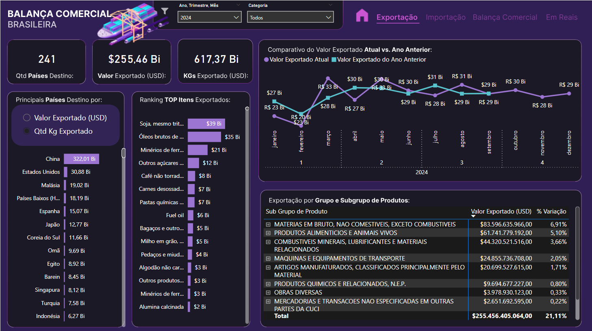
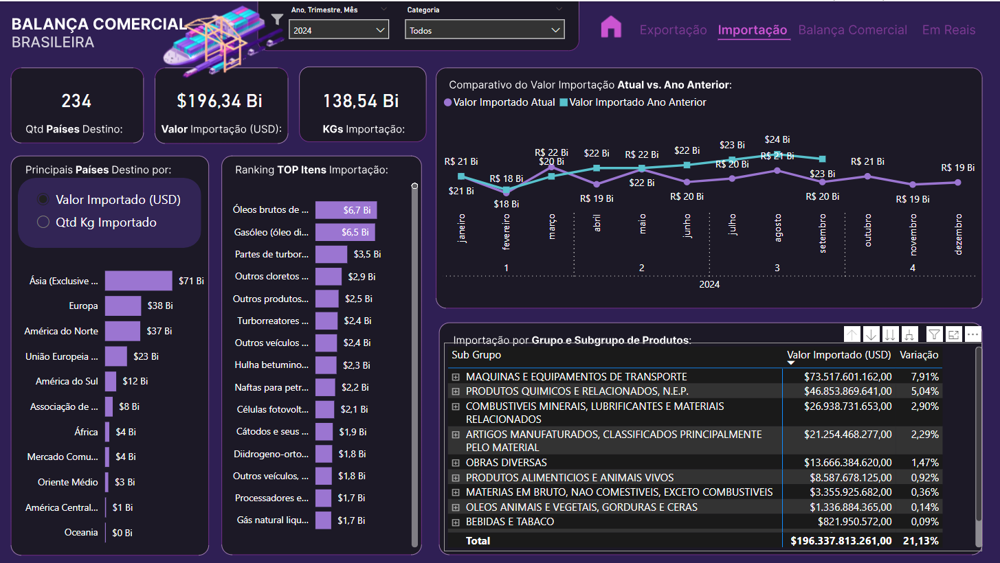
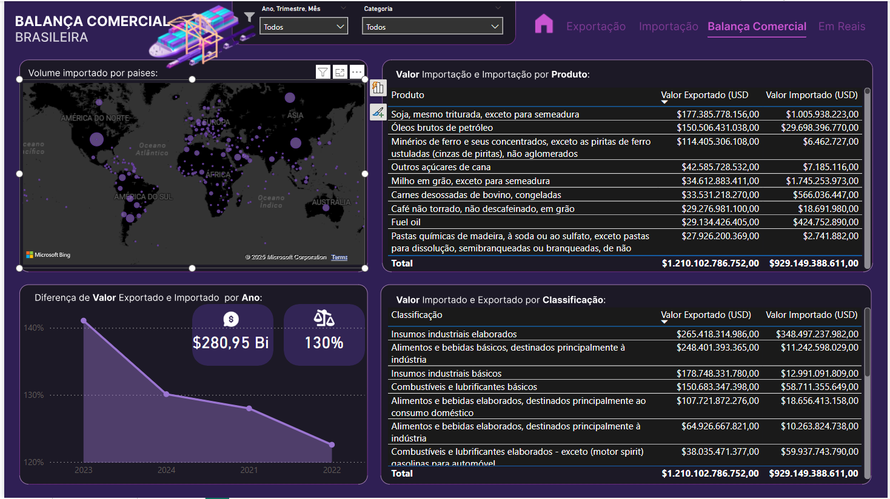
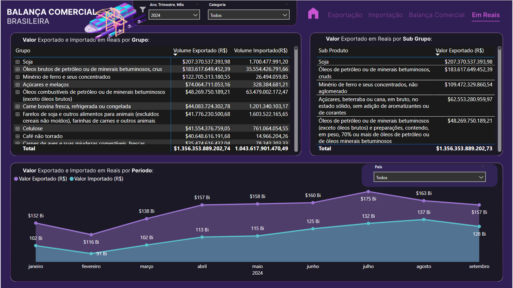

# balanca_comercial_Brasileira

Este projeto foi desenvolvido no **Power BI**, com foco na análise aprofundada  do cenário de importação e exportação do Brasil. O projeto foi realizado como projeto final para tirar a certificação do curso **DataDriven**, ministrado por **Leticia Ismirele** e **Karine Lagos**, com o objetivo de aplicar conceitos de visualização e análise de dados com dados reais exportado da base de dados aberta. 
O Objetivo final é a criação de um relatório visual interativo que permita explorar tendencias e realizar comparaçoes dos principais indicadores. 

---

## 📊 Requisitos
### Indicadores de Comércio
- **Valor Total de Exportações e Importações: Total de transações em USD por país e produto.
- **Volume de Exportações e Importações: Soma das quantidades exportadas/importadas.
- **Balança Comercial por Pais e Produto: Diferença entre exportações e importações para cada país e produto.
###  Indicadores Temporais
- **Tendência Mensal e Trimestral de Transações: Análise dos valores e quantidades ao longo de 2024.
- **Crescimento ou Declínio de Categorias de Produto: Comparação de valores mensais/trimestrais para identificar variações em categorias NCM.
### Indicadores por Continente e Categoria
- **Distribuição Geográfica das Transações: Volume e valor total por continente.
- **Análise de Categorias de Produtos (CGCE e CUCI): Distribuição e volume das transações com base nas classificações CGCE e CUCI.
### Indicadores Comparativos e de Ranking
- **Top Produtos Exportados e Importados: Lista dos principais produtos em valor e quantidade.
- **Top Países em Comercio Bilateral: Identificação dos países com maiores volumes de troca com o Brasil.
### Balança Comercial
- **Mapa - Importação por País: mostra visualmente os países com volume de importação.​
- **Valor Exportado e Importado por NCM: lista produtos com valores exportados e importados, organizados por Nomenclatura Comum do Mercosul (NCM).​
- **% Variação Exportação e Importação: percentual de variação das exportações e importações ao longo dos anos.​
- **Diferença de Exportação: valor total da diferença entre exportações e importações.​
- **Valor Exportado e Importado por Subclassificação: apresenta o valor de exportação e importação por tipo de subcategoria de produtos.
### Resumo de Indicadores em Reais
- **Valor Total de Exportações e Importações: Total de transações em BRL por país e produto. ​Para isso, utilize uma base de dados de dólar (um exemplo é disponibilizado na Plataforma)
### Balança Comercial em Real Acumulada
- Valor da Balança Comercial: Com ajuste de acumulo por um parâmetro que ao ser acionado altera a formula de acúmulo

---

## 🗂️ Base de Dados

---

## 🛠️ Ferramentas Utilizadas
- **Microsoft Power BI**: desenvolvimento dos dashboards interativos.
- **Microsoft Excel**: apoio na manipulação e organização dos dados brutos.
- **DAX e Power Query**: criação de medidas, colunas calculadas e transformação dos dados.
- **Figma**: criação do fundo de tela e capa.

---

## 📈 Resultados

- **Capa**

- **Exportação**

- **Importação**

- **Balança Comercial*

- **Balança em Reais*

Para explorar e interagir com o relatório completo, acesse o link abaixo:

[🔗 Clique aqui para interagir com o relatório]([https://app.powerbi.com/reportEmbed?reportId=2133d8d7-e6a6-46cf-9c4c-920837952905&autoAuth=true&ctid=d4f732bb-4afd-44b5-abea-ec3fa01667de](https://app.powerbi.com/reportEmbed?reportId=cc50c9e3-54ba-4d0b-82ff-35cc9e4d608c&autoAuth=true&ctid=d4f732bb-4afd-44b5-abea-ec3fa01667de))

---

### 👩‍💻 Contato

Estou disponível para propostas de emprego, auditorias de dados ou projetos relacionados à análise e visualização de dados. 
Todos os meus contatos estão disponíveis na minha página inicial do GitHub: [beto86](https://github.com/beto86). 
Sinta-se à vontade para visitar e entrar em contato!
